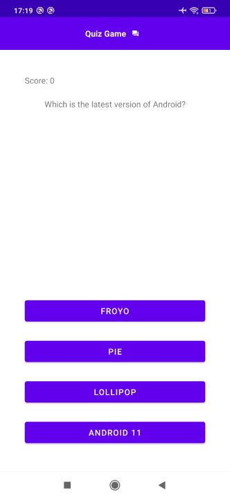

## Quiz Game Android Kotlin

> 👷 Developed by Matheus Ramalho de Oliveira  
🔨 Brazilian Software Engineer  
🏡 Goiânia, Goiás, Brasil  
✉️ kastorcode@gmail.com  
👍 [instagram.com/kastorcode](https://instagram.com/kastorcode)

---

  

  A Q&A game. Developed in the <a href="https://udemy.com/share/1046Hs" target="_blank">Android App Development & Android Hacking, Android Security</a> course.

---

### Screenshots

  

---

### 🧰 Tools used
[Android Backup Extractor](https://github.com/nelenkov/android-backup-extractor)  
[Android Studio](https://developer.android.com/studio)  
[APK Studio](https://vaibhavpandey.com/apkstudio)  
[Apktool](https://ibotpeaches.github.io/Apktool)  
[Bytecode Viewer](https://bytecodeviewer.com)  
[jadx](https://github.com/skylot/jadx)  
[Uber Apk Signer](https://github.com/patrickfav/uber-apk-signer)  
[Visual Studio Code](https://code.visualstudio.com)  

---

### 🗓️ Roadmap
- Course Overview
- Introduction to Android
- Android Architecture
- Introduction to Android Development
- Environment Setup
- Development Environment
- Basics of Java Syntax
- Operators
- Control Flow Statements
- Methods Functions
- Java Object Oriented Concept
- Object Oriented Programming
- Wrapper Classes, Auto-Boxing and Unboxing
- Strings
- Exception Handling
- Let's Start Android Application Development
- Android Components
- User Interactions
- Lists & Views
- Components and LifeCycles
- Shared Preferences and Data Saving
- Device Compatibility
- Android Project 1
- Publishing Your App on Google Play
- Android Project 2
- Android's Security Model
- Setting Up the Laboratory for Android Security Testing
- Android Static Security Analysis
- Android Pentesting

---

  <big><b>&lt;kastor.code/&gt;</b></big>

